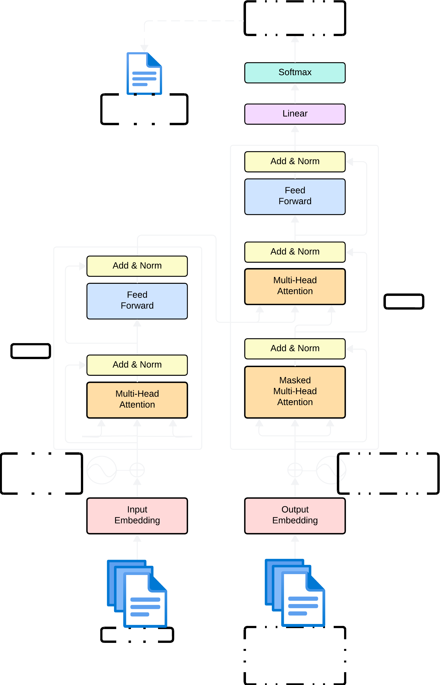

# ASR-with-Speech-Sentiment-&-Text-Summarizer

<div align="center">

       

</div>

## Introduction

<div align="center">


</div>

This project aims to develop an advanced system that integrates __Automatic Speech Recognition (ASR)__, __Speech Emotion Recognition (SER)__, and __Text Summarizer__. The system will address challenges in accurate speech recognition across diverse accents and noisy environments, providing real-time emotional tone interpretation (sentiment analysis), and generating summaries to retain essential information. Targeting applications such as customer service, business meetings, media, and education, this project seeks to enhance documentation, understanding, and emotional context in communication.

## Intermediate Goals

- [x] **Baseline Model for ASR:** CNN-BiLSTM
- [x] **Baseline Model for SER:** XGBoost
- [x] **Baseline Model for Text Summarizer:** T5-Small, T5-Base
- [x] **Final Model for ASR:** Conformer
- [ ] **Final Model for SER:** Stacked CNN-BiLSTM with Self-Attention
- [x] **Final Model for Text Summarizer:** BART Large

## Goals

- [ ] **Accurate ASR System:** Handle diverse accents and operate effectively in noisy environments
- [ ] **Emotion Analysis:** Through tone of speech
- [x] **Meaningful Text Summarizer:** Preserve critical information without loss
- [ ] **Integrated System:** Combine all components to provide real-time transcription and summaries

## Contributors 

<a href="https://github.com/LuluW8071/ASR-with-Speech-Sentiment-and-Text-Summarizer/graphs/contributors">
  
</a>

## Project Architecture

### 1. ASR (Automatic Speech Recognition)

| Base Model </br>(CNN-Bi_LSTM)              | Final Model </br>  |
|---------------------|-----------------------------------------------|
|           |            

### 2. SER (Speech Emotion Recognition)

| Base Model</br>(XGBoost)            | Final Model </br>  |
|---------------------|-----------------------------------------------|
|           |          

### 3. Text Summarizer

| Base Model </br>(T5-Small, T5-Base)           | Final Model </br>  |
|---------------------|-----------------------------------------------|
|          |          

## High Level Next Steps


# Usage

### Clone the Repository
> [!IMPORTANT]
To clone the repository with its sub-modules, enter the following command:

```bash
git clone --recursive https://github.com/LuluW8071/ASR-with-Speech-Sentiment-and-Text-Summarizer.git
```

#### 1. Install Required Dependencies

> [!IMPORTANT]  
> Before installing dependencies from `requirements.txt`, make sure you have installed \
>  __No need to install **CUDA ToolKit** and **PyTorch CUDA** for inferencing. But make sure to install **PyTorch CPU**.__
> - [**CUDA ToolKit v11.8/12.1**](https://developer.nvidia.com/cuda-toolkit-archive)
> - [**PyTorch**](https://pytorch.org/)
> - [**SOX**](https://sourceforge.net/projects/sox/)
>     - **For Linux:**
>         ```bash
>         sudo apt update
>         sudo apt install sox libsox-fmt-all build-essential zlib1g-dev libbz2-dev liblzma-dev
>         ```
> 
> - [**PyAudio**](https://people.csail.mit.edu/hubert/pyaudio/)
>     - **For Linux:**
>       ```bash
>       sudo apt-get install libasound-dev portaudio19-dev libportaudio2 libportaudiocpp0
>       sudo apt-get install ffmpeg libav-tools
>       sudo pip install pyaudio    
>       ```

```bash
pip install -r requirements.txt
```

#### 2. Configure [**Comet-ML**](https://www.comet.com/site/) Integration

> [!NOTE]
> Replace `dummy_key` with your actual Comet-ML API key and project name in the `.env` file to enable real-time loss curve plotting, system metrics tracking, and confusion matrix visualization.

```python
API_KEY = "dummy_key"
PROJECT_NAME = "dummy_key"
```

## Usage Instructions

### ASR (Automatic Speech Recognition)
#### 1. Audio Conversion

> [!NOTE]
> `--not-convert` if you don't want audio conversion

```bash
py common_voice.py --file_path file_path/to/validated.tsv --save_json_path file_path/to/save/json -w 4 --percent 10 --output_format wav/flac
```

#### 2. Train Model

> [!NOTE]
> `--checkpoint_path path/to/checkpoint_file` to load pre-trained model and fine tune on it.

```bash
py train.py --train_json path/to/train.json --valid_json path/to/test.json -w 4 --batch_size 64 -lr 2e-4 --lr_step_size 10 --lr_gamma 0.2 --epochs 50
```

#### 3. Sentence Extraction

> [!NOTE]
> Run the `extract_sentence.py` to get quick sentence corpus for language modeling.

```bash
py extract_sentence.py --file_path file_path/to/validated.tsv --save_txt_path file_path/to/save/txt
```

#### 4. CTC Decoder Installation

> [!WARNING]
> __CTC Decoder__ can only be installed for Linux. So, make sure you have installed **Ubuntu** or **Linux** OS.

```bash
sudo apt update
sudo apt install sox libsox-fmt-all build-essential zlib1g-dev libbz2-dev liblzma-dev
```

> [!NOTE]
> After installing CTC Decoder, make sure to create the `pyproject.toml` file inside the `src/ASR-with-Speech-Sentiment-Analysis-Text-Summarizer/Automatic_Speech_Recognition/submodules/ctcdecode` directory and paste the following code:

```toml
[build-system]
requires = ["setuptools", "torch"]
```

Finally, open the terminal in that `ctcdecode` directory & install __CTC Decoder__ using the following command:

```bash
pip3 install .
```
> [!NOTE]
> This takes few minutes to install.

#### 5. Ken Language Modeling 

> Use the previous extracted sentences to build a language model using [KenLM](https://github.com/kpu/kenlm).

Build __KenLM__ `src/ASR-with-Speech-Sentiment-Analysis-Text-Summarizer/Automatic_Speech_Recognition/submodules/ctcdecode/third_party/kenlm` directory using cmake and compile the language model using $lmplz$:

```bash
mkdir -p build
cd build
cmake ..
make -j 4
lmplz -o n <path/to/corpus.txt> <path/save/language/model.arpa>
```

Follow the instruction on [KenLM repository](https://github.com/kpu/kenlm) `README.md` to convert `.arpa` file to `.bin` for faster inference. 

#### 6. Freeze the Model

After training, freeze the model using `freeze.py`:

```bash
py freeze.py --model_checkpoint "path/model/speechrecognition.ckpt" --save_path "path/to/save/"
```

#### 7. ASR Demo:

- For Terminal Inference:

```bash
python3 engine.py --file_path "path/model/speechrecognition.pt" --kenlm_file "path/to/nglm.arpa or path/to/nglm.bin"
```

- For Web Interface:

```bash
python3 app.py --file_path "path/model/speechrecognition.pt" --kenlm_file "path/to/nglm.arpa or path/to/nglm.bin"
```

### Speech Sentiment

#### 1. Audio Downsample and Augment

> [!NOTE]
> Run the `Speech_Sentiment.ipynb` first to get the *path* and *emotions* table in csv format and downsample all clips.


```bash
py downsample.py --file_path path/to/audio_file.csv --save_csv_path output/path -w 4 --output_format wav/flac
```

```bash
py augment.py --file_path "path/to/emotion_dataset.csv" --save_csv_path "output/path" -w 4 --percent 20
```

#### 2. Train the Model

```bash
py neuralnet/train.py --train_csv "path/to/train.csv" --test_csv "path/to/test.csv" -w 4 --batch_size 256 --epochs 25 -lr 1e-3
```

### Text Summarization

> [!NOTE]
> Just run the Notebook File in `src/Text_Summarizer` directory. 
>  You may need 🤗 Hugging Face Token with write permission file to upload your trained model directly on the 🤗 HF hub.

# Data Source

| Project            | Dataset Source                            | |
|--------------------|-------------------------------------------|-|
| __ASR__                | [Mozilla Common Voice](https://commonvoice.mozilla.org/en/datasets),  [LibriSpeech](https://www.openslr.org/12/), [Mimic Record Studio](https://github.com/MycroftAI/mimic-recording-studio)                     |     |
| __SER__   | [RAVDESS](https://www.kaggle.com/datasets/uwrfkaggler/ravdess-emotional-speech-audio), [CremaD](https://www.kaggle.com/datasets/ejlok1/cremad), [TESS](https://www.kaggle.com/datasets/ejlok1/toronto-emotional-speech-set-tess), [SAVEE](https://www.kaggle.com/datasets/ejlok1/surrey-audiovisual-expressed-emotion-savee)                   |   |
| __Text Summarizer__                |   [XSum](https://huggingface.co/datasets/EdinburghNLP/xsum), [BillSum](https://huggingface.co/datasets/FiscalNote/billsum)           |   |


## Code Structure

The code styling adheres to `autopep8` formatting.

# Results

| Project            |  Base Model Link                 | Final Model Link |
|--------------------|---------------------------------------|---------------------|
| __ASR__                |   [CNN-BiLSTM](https://img.shields.io/badge/status-in_progress-red.svg)                | [Conformer](https://img.shields.io/badge/status-in_progress-red.svg) |
| __SER__   |  [XGBoost](https://img.shields.io/badge/status-in_progress-red.svg)                                  |   |
| __Text Summarizer__    | [T5 Small-FineTune](https://huggingface.co/luluw/t5-small-finetuned-xsum), [T5 Base-FineTune](https://huggingface.co/luluw/t5-base-finetuned-billsum) | [BART](https://img.shields.io/badge/status-in_progress-red.svg)  |

## Metrics Used

| Project            | Metrics Used                          | 
|--------------------|---------------------------------------|
| __ASR__                  | WER, CER                              |
| __SER__   | Accuracy, F1-Score, Precision, Recall |
| __Text Summarizer__    | Rouge1, Rouge2, Rougel, Rougelsum, Gen Len |

### Loss Curve Evaluation

| Project            | Base Model                 | Final Model Link |
|--------------------|-----------------------------|-------------------|
| ASR                | [CNN-BiLSTM](https://img.shields.io/badge/status-in_progress-red.svg) |  |
| Speech Sentiment   | [XGBoost](https://img.shields.io/badge/status-in_progress-red.svg)  |  |
| Text Summarizer    |  |  |

### Evaluation Metrics Results

| Project            | Base Model                 | Final Model Link |
|--------------------|-----------------------------|-------------------|
| ASR                | [CNN-BiLSTM](https://img.shields.io/badge/status-in_progress-red.svg) |  |
| Speech Sentiment   | [XGBoost](https://img.shields.io/badge/status-in_progress-red.svg)  |  |
| Text Summarizer    | </br>  |  |