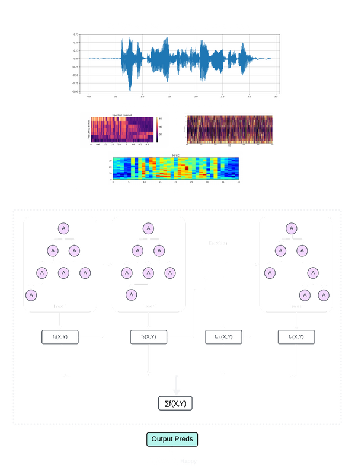

# ASR-with-Speech-Sentiment-Analysis-and-Text-Summarizer

<div align="center">

       

</div>

## Introduction

This project aims to develop an advanced system that integrates Automatic Speech Recognition (ASR), speech sentiment analysis, and text summarization. The system will address challenges in accurate speech recognition across diverse accents and noisy environments, providing real-time emotional tone interpretation (sentiment analysis), and generating summaries to retain essential information. Targeting applications such as customer service, business meetings, media, and education, this project seeks to enhance documentation, understanding, and emotional context in communication.

## Intermediate Goals

- [x] Baseline Model for ASR
- [x] Baseline Model for SER
- [x] Baseline Model for Text Summarizer

## Goals

- [ ] Accurate ASR system for diverse accents and operable in noisy environments.
- [ ] Emotion Analysis through tone of speech.
- [ ] Meaningful Text Summarizer without loss of critical information.
- [ ] Integrating each component into one cohesive system provides real-time transcription and summaries.

## Contributors 
<a href="https://github.com/LuluW8071/ASR-with-Speech-Sentiment-and-Text-Summarizer/graphs/contributors">
  
</a>


## Project Architecture

### 1. ASR(Automatic Speech Recognition)

| Base Model </br>(1CNN1D - Dense_Layers - 2Bi_LSTM)              | Final Model </br>  |
|---------------------|-----------------------------------------------|
|           |                                  |

### 2. SER(Speech Emotion Recognition)

| Base Model</br>(XGBoost)            | Final Model </br>  |
|---------------------|-----------------------------------------------|
|           |          

### 3. Text Summarizer

| Base Model </br>(T5-Small, T5-Base)           | Final Model </br>  |
|---------------------|-----------------------------------------------|
|          |          

## High Level Next Steps


# Usage
## Installation
<!--To begin this project, use the included `Makefile`

#### Creating Virtual Environment

This package is built using `python-3.8`. 
We recommend creating a virtual environment and using a matching version to ensure compatibility.

#### pre-commit

`pre-commit` will automatically format and lint your code. You can install using this by using
`make use-pre-commit`. It will take effect on your next `git commit`

#### pip-tools

The method of managing dependencies in this package is using `pip-tools`. To begin, run `make use-pip-tools` to install. 

Then when adding a new package requirement, update the `requirements.in` file with 
the package name. You can include a specific version if desired but it is not necessary. 

To install and use the new dependency you can run `make deps-install` or equivalently `make`

If you have other packages installed in the environment that are no longer needed, you can you `make deps-sync` to ensure that your current development environment matches the `requirements` files.  -->

#### 1. Install Required Dependencies

Before installing dependencies from `requirements.txt`, make sure you have installed 
- [**CUDA ToolKit v11.8/12.1**](https://developer.nvidia.com/cuda-toolkit-archive)
- [**PyTorch**](https://pytorch.org/)
- [**SOX**](https://sourceforge.net/projects/sox/)
    - **For Linux:**
        ```bash
        # Update package list and install SOX
        sudo apt update
        sudo apt install sox libsox-fmt-all portaudio19-dev

        # Verify installation
        sox --version
        ```

```bash
pip install -r requirements.txt
```

#### 2. Configure [**Comet-ML**](https://www.comet.com/site/) Integration

Replace `dummy_key` with your actual Comet-ML API key and project name in the `.env` file to enable real-time loss curve plotting, system metrics tracking, and confusion matrix visualization.

```python
API_KEY = "dummy_key"
PROJECT_NAME = "dummy_key"
```

## Usage Instructions

### ASR

1. Audio Conversion
    > `--not-convert` if you don't want audio conversion
    ```bash
    py common_voice.py --file_path "file_path/to/validated.tsv" 
                       --save_json_path "file_path/to/save/json" 
                       -w 4
                       --percent 10 
                       --output_format 'wav' or 'flac'
    ```

2. Train Model
    > `--checkpoint_path "path/to/checkpoint_file"` to load pre-trained model and fine tune on it.
    ```bash
    py train.py --train_json "path/to/train.json" 
                --valid_json "path/to/test.json" 
                -w 4 
                --batch_size 128 
                -lr 2e-4
                --epochs 20 
    ```

### Speech Sentiment

1.  Audio Downsample and Augment

    Run the `Speech_Sentiment.ipynb` first to get the *path* and *emotions* table in csv format and downsample all clips.

    ```bash
    py downsample.py --file_path "path/to/audio_file.csv" 
                     --save_csv_path "output/path" 
                     -w 4
                     --output_format 'wav' or 'flac'
    ```

    ```bash
    py augment.py --file_path "path/to/emotion_dataset.csv" 
                  --save_csv_path "output/path" 
                  -w 4
                  --percent 20 
    ```

2. Train the model

   ```bash
    py neuralnet/train.py --train_csv "path/to/train.csv" 
                          --test_csv "path/to/test.csv" 
                          -w 4 
                          --batch_size 256 
                          --epochs 25
                          -lr 1e-3
    ```

### Text Summarization

> Just run the Notebook File in `src/Text_Summarizer` directory. 
> **Note:** You may need 🤗 Hugging Face Token with write permission file to upload your trained model directly on the 🤗 HF hub.

1. To Export hugging face models to ONNX runtime 
> Example

```bash
optimum-cli export onnx --model luluw/t5-base-finetuned-billsum base_onnx/
!python3 -m optimum.exporters.onnx --model=luluw/t5-base-finetuned-billsum base-onnx/
```

# Data Source

| Project            | Dataset Source                            |
|--------------------|-------------------------------------------|
| ASR                | [Mozilla Common Voice](https://commonvoice.mozilla.org/en/datasets)                     |
| Speech Sentiment   | [RAVDESS](https://www.kaggle.com/datasets/uwrfkaggler/ravdess-emotional-speech-audio), [CremaD](https://www.kaggle.com/datasets/ejlok1/cremad), [TESS](https://www.kaggle.com/datasets/ejlok1/toronto-emotional-speech-set-tess), [SAVEE](https://www.kaggle.com/datasets/ejlok1/surrey-audiovisual-expressed-emotion-savee)                   |
| Text Summarizer                |   [XSum](https://huggingface.co/datasets/EdinburghNLP/xsum), [BillSum](https://huggingface.co/datasets/FiscalNote/billsum)           |

## Code Structure

## Artifacts Location

# Results

| Project            |  Base Model Link                 | Final Model Link |
|--------------------|---------------------------------------|---------------------|
| ASR                |   [CNN-BiLSTM](https://img.shields.io/badge/status-in_progress-red.svg)                |  |
| Speech Sentiment   |  [XGBoost](https://img.shields.io/badge/status-in_progress-red.svg)                                  |   |
| Text Summarizer    | [T5 Small-FineTune](https://huggingface.co/luluw/t5-small-finetuned-xsum), [T5 Base-FineTune](https://huggingface.co/luluw/t5-base-finetuned-billsum) |   |


## Metrics Used

| Project            | Metrics Used                          | 
|--------------------|---------------------------------------|
| ASR                | WER, CER                              |
| Speech Sentiment   | Accuracy, F1-Score, Precision, Recall |
| Text Summarizer    | Rouge1, Rouge2, Rougel, Rougelsum, Gen Len |

## Evaluation Results

### ASR


### Speech Sentiment


### Text Summarization

| Model | Train Loss | Epoch | Step | Val Loss | Rouge1  | Rouge2  | Rougel  | Rougelsum | Gen Len |
|-------|------------|-------|------|----------|---------|---------|---------|-----------|---------|
| **T5 XSum Small**   | 2.7635     | 1.0   | 2041 | 2.5150   | 27.6651 | 7.3702  | 21.7165 | 21.7178   | 18.8121 |
|       | 2.7114     | 2.0   | 4082 | 2.4780   | 28.3617 | 7.7832  | 22.3142 | 22.3121   | 18.8227 |
|       | 2.695      | 3.0   | 6123 | 2.4684   | 28.451  | 7.8513  | 22.3844 | 22.3826   | 18.8292 |


| Model | Train Loss | Epoch  | Step | Val Loss | Rouge1  | Rouge2  | Rougel  | Rougelsum | Gen Len  |
|:-------------|:-------------:|:------:|:----:|:---------------:|:-------:|:-------:|:-------:|:---------:|:--------:|
| **T5 BillSum Base**   | 2.5944        | 0.4219 | 500  | 1.2582          | 50.6899 | 31.6418 | 40.2325 | 44.2687   | 111.7541 |
|| 1.3588        | 0.8439 | 1000 | 1.1591          | 55.865  | 35.992  | 44.7636 | 49.2805   | 114.3552 |
|| 1.275         | 1.2658 | 1500 | 1.1214          | 56.3449 | 37.0781 | 45.604  | 49.9711   | 110.7724 |
|| 1.3266        | 1.6878 | 2000 | 1.1791          | 54.4797 | 33.8689 | 43.1813 | 47.8507   | 114.8278 |
|| 1.3591        | 2.1097 | 2500 | 1.1725          | 54.243  | 33.5179 | 42.9187 | 47.6231   | 116.4601 |
|| 1.3484        | 2.5316 | 3000 | 1.1724          | 54.1433 | 33.3914 | 42.8348 | 47.5267   | 116.7736 |
|| 1.3467        | 2.9536 | 3500 | 1.1724          | 54.1359 | 33.3794 | 42.8167 | 47.5153   | 116.7819 |
|| 1.3483        | 3.3755 | 4000 | 1.1724          | 54.1446 | 33.3947 | 42.8274 | 47.5313   | 116.8529 |
|| 1.342         | 3.7975 | 4500 | 1.1724          | 54.1341 | 33.3888 | 42.8239 | 47.5291   | 116.7957 |
|| 1.3475        | 4.2194 | 5000 | 1.1725          | 54.1411 | 33.3931 | 42.8224 | 47.5218   | 116.8229 |
|| 1.3542        | 4.6414 | 5500 | 1.1725          | 54.1481 | 33.3953 | 42.8337 | 47.5287   | 116.8581 |
